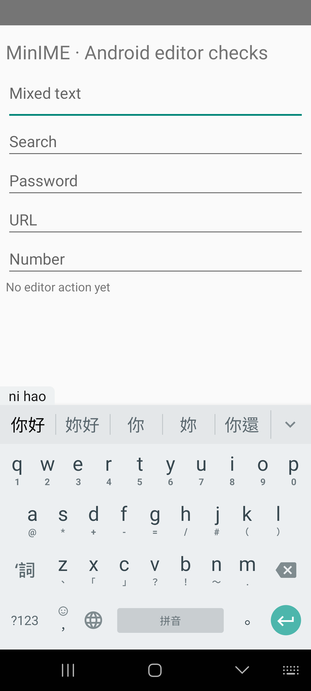
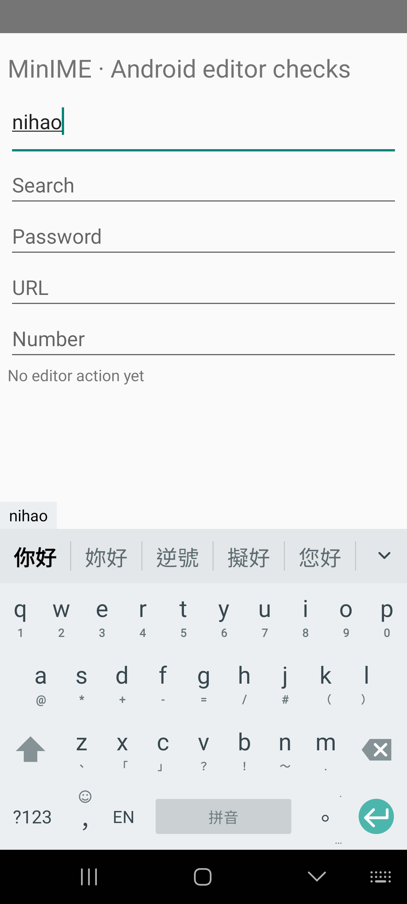
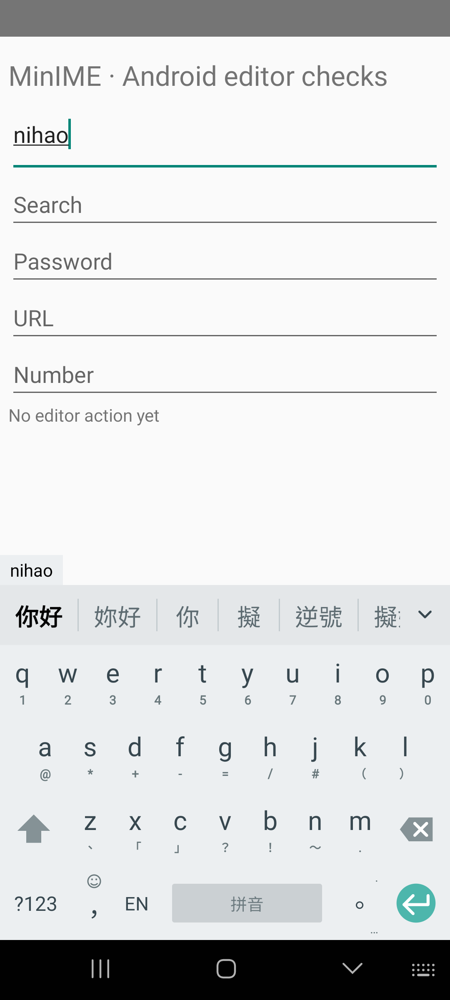

# First-character selection in Pinyin

## Diagnosis and change audit (2026-09-14)

Type: candidate-access bug fix, with an intentional change to Chinese display order.
The user requested Google Zhuyin's mixed phrase/character experience.

Six paired observations on RFCR91GWXLX reproduce the difference: Google shows
`你好、妳好、你、妳、你還` for `nihao` and `今天、津田、金、進、今` for `jintian`.
MinIME shows phrase alternatives across the row, with characters buried in the
expanded list. This is diagnostic evidence, not an accuracy corpus.

Two owning boundaries are implicated:

* CompositionEngine's whole-before-prefix partition deliberately moves every
  first-character alternative after all whole-input choices, including completions.
* The native adapter shares a 12-candidate prefix quota between long phrases and
  characters. In the existing 4,237-query Chinese regression corpus, 259 queries
  have a whole match and characters in the native first 100 but lose all those
  characters to the prefix quota. This is an access count, not semantic accuracy.
  A first-100 scan cannot establish that a character is absent from the dictionary.

The fix must retain the whole-phrase Space choice and its visible first position,
mix first-character choices near the start, and preserve the unconsumed Pinyin on
explicit selection. Native retrieval must retain character alternatives separately
from longer prefixes, with bounded work. It must use decoder syllable boundaries,
not infer them from glyph count or enumerate guessed substring splits.

Risks: reserving row positions displaces lower-ranked whole phrases; supplemental
native lookup can cost time. Measure both with existing frozen regression inputs.
No dictionary data, learning settings, sentence construction, other language modes,
keyboard geometry, or persistent formats should change. Verify shared core and the
pinned native evaluator before building Android; verify taps and cleanup on phone.

## Implementation and local results

The shared core retains two leading phrase choices, then mixes in two existing
single-Han prefix choices. Remaining candidates stay available in the same list.
The native Android and desktop adapters share a 12-character reserve, independent
of the original 12-prefix quota. If the first 100 candidates do not fill it, one
bounded query uses the first phrase's decoder-provided syllable span. Its first
100 candidates supply only single characters that consume that complete span.
Full-phrase queries, source vocabulary, and automatic-construction policy are unchanged.

`tools/test-core.ps1`: 306,634 contract assertions pass, including first-character
snapshot selection with 24 competing phrases, private fields, apostrophes, and
supplementary Han. These are software contracts, not language accuracy.

`tools/test-desktop.ps1`: all 13,014 frozen input rows replayed. Comparison with
the unmodified HEAD core/native adapter found zero Space-output changes across
8,999 Chinese observations and zero changes across 12,045 English observations
(English rows are replayed in three modes). Every previously present target
remained available. No new construction was introduced.

The deliberate display tradeoff is measurable: 234 Chinese targets moved beyond
the first eight positions. Full-spelling target coverage changed from 1,928/2,000
to 1,917/2,000; initials from 658/2,000 to 568/2,000. This change improves character
access, not phrase accuracy. A row is pixel-limited, so first-eight coverage is not
a physical first-row measurement. Existing dev/test labels describe consumed
regression splits, not fresh holdouts.

`tools/audit_first_glyph.py` on 4,237 unique Chinese inputs: inputs with a partial
single-character option increased from 2,492 to 3,929 (+1,437). No existing native
candidate was removed; full-input native order was unchanged; no constructed
candidate appeared. The denominator includes single-syllable inputs, for which
a partial first-character choice need not exist; this is not a recall percentage.

First replay's native IPC+decoder p50 was 1.883 → 2.048 ms, p95 3.077 → 4.369 ms.
This desktop measurement includes process communication and is not Android typing
latency. The broader desktop replay also passed with p95 4.531 ms. Builds/evaluation
overlapped some measurement windows; treat timings as approximate, not a controlled
performance acceptance result.

A second native replay with no build or desktop evaluation running reproduced all
access counts: p50 1.974 → 2.088 ms; p95 3.211 → 4.412 ms. The preserved native
records and executable/corpus hashes are in [evidence/native-summary.json](evidence/native-summary.json).
The baseline is repository HEAD `a310cf87b3fa084de6942f61f6e968ca116b4f1f`.
Run `python -X utf8 tools/audit_first_glyph.py <baseline-exe> <fixed-exe>` after
building each revision with `tools/build-desktop-metadata.ps1 -SourceOnly`.

## Phone verification

All six targeted Android integration tests passed: direct first-character taps,
remaining-input editing/deletion/mode switching, English visible defaults, packaged
native data, prefix consumption, and bounded noise. The new core regression fails
against the baseline with `expected [甲] actual [詞組2]`, and passes after the fix.

Four reference selection traces (`nihao`, `jintian`, `xianzai`, `zhongguo`) were
replayed before and after. Google completed all four; baseline MinIME could not
find the requested character in its visible row in all four. Fixed MinIME completed
all four without expansion. The paired recorder catches unavailable controls, so
its instrumentation "OK" alone is not the result: individual statuses were checked.
See [before](evidence/selection-before.json) and [after](evidence/selection-after.json).

This establishes mixed access, not identical ranking or composition semantics.
Google's next default after selecting 金 from `jintian` was 田; MinIME's was 天.
Google retains its chosen prefix internally until final acceptance, whereas MinIME
commits the explicitly selected character and composes the remaining Pinyin. This
existing lifecycle behavior was preserved. Google ranks 妳 ahead of 擬 for `ni`;
MinIME retains its existing source order rather than adding word-specific promotions.

The 84 packaged native query samples measured p50 10.390 ms, p95 21.847 ms, maximum
26.465 ms for the candidate query. These are warm native-call timings (each follows
a full-only query), not touch-to-pixel latency or physical touch accuracy. Four
center-coordinate taps passed the actual visible path; this is not a touch hit-rate
benchmark. Three long/noisy inputs completed in 10.969–39.000 ms without assembly.

Tests used only RFCR91GWXLX after explicit SHINE acknowledgements and under the
shared phone mutex. Every session restored Samsung IME and MinIME preferences,
verified display OFF, and released the reservation. No AOD changes were made.
The first test-report collection used an incorrect filename; the actual
`rime-phone.json` was subsequently collected under the lease and is preserved here.

No release version or Play bundle was produced by this fix. The locally built
debug APK contains the change; existing signed release artifacts are unchanged.
