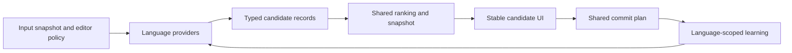

# One interaction contract, language-specific knowledge

Review baseline: **d353be4 / MinIME 0.8.2**, September 11, 2026.
This is a review with freshly compiled shared-core diagnostics. No production
code, dictionary entries, settings, APK or phone state changed. Findings below
separate demonstrated defects, current capability gaps and proposed policy changes.

## Decision

Share **candidate meaning, input ownership, acceptance, learning events, scheduling,
visibility and evaluation**. Specialize **orthography, reading units, morphology,
language models and output forms**. The user should encounter the same rules for
what a candidate consumes and how it can be selected, without forcing all languages
through a Pinyin parser or one undifferentiated dictionary score.

The important distinction is three layers, not simply shared versus specialized:

| Layer | Responsibility | Examples |
| --- | --- | --- |
| Shared interaction contract | What the user can rely on | No lost suffix; current highlight agrees with Space; stable candidate identity; consistent English assistance; privacy; latency deadlines |
| Language knowledge/provider | How valid candidates are produced | Pinyin/Zhuyin readings, POJ tones and CH orthography, Japanese kana and grammatical conversion, English spelling and contraction rules |
| Mode policy | What the user explicitly prioritizes | 中文/English, 台語/English, 日本語/English, English-only; focused-language preference, allowed output forms and optional learning |

Mode selection may change language preference. It should not change the meaning of
an English selection, disable its learning, silently use different acceptance
semantics, or let weak source metadata stand in for language quality.

## Current capabilities are genuinely unequal

| Capability | Chinese focus | English-only | Taiwanese focus | Japanese focus |
| --- | --- | --- | --- | --- |
| Main generation | Rime Pinyin plus core lexical/fallback results; separate Zhuyin path | Frequency-ranked words, spelling alternatives | Source-entry lookup | Source-entry lookup plus WanaKana spelling fallback |
| Partial input | Native prefix choices, syllable/full/initial/mixed lookup, phrase paths | Word-prefix completion and one-edit alternatives | Prefix and incomplete source-unit lookup of one entry | Prefix and incomplete source-unit lookup of one entry; kana fallback can consume a prefix |
| Productive multi-entry conversion | Present, with quality protections around fallback combinations | Word entry/correction, not phonetic phrase conversion | No grammatical phrase decoder | Kana strings available; no sentence-level Kanji/inflection decoder |
| After-commit predictions | Chinese continuations | English context predictions and optional adaptation | No idle predictions | No idle predictions |
| Explicit choice adaptation | Existing Chinese context/raw keys | English context/raw keys | Focus-scoped choices | Focus-scoped choices, except partial-selection path |
| New phrase observation | Chinese Han phrase session | Separate English continuation path | Not implemented | Not implemented |
| Evidence behind ordering | Native order, base frequencies/context, explicit choices | Word frequencies, spelling metadata, explicit choices | Mostly equal score plus source-tier order and explicit choices | Same, plus character rank and kana fallback order |

Pointers: [CompositionEngine](../../core/src/main/java/dev/minime/core/CompositionEngine.java),
[AddonDictionary](../../core/src/main/java/dev/minime/core/AddonDictionary.java),
[PhoneticDictionary](../../core/src/main/java/dev/minime/core/PhoneticDictionary.java),
[JapaneseBasics](../../core/src/main/java/dev/minime/core/JapaneseBasics.java),
[JapaneseKana](../../core/src/main/java/dev/minime/core/JapaneseKana.java).
Rime receives the current spelling, not surrounding editor text, and its native
session is configured not to learn; MinIME owns the separate adaptation paths.
A larger word list cannot by itself supply the missing Taiwanese/Japanese grammar
or continuation capability.

## Confirmed problems to prioritize

### 1. Pinyin-specific acceptance can discard Japanese suffixes — fix first

`CompositionEngine.partial()` (line 261 at this revision) honors `consumed` only
when the raw input matches a lowercase Pinyin-shaped regex. `JapaneseKana` supports
upper/title case and hyphens, so a valid provider prefix can bypass that check.
Explicit selection then takes the whole-token commit path and clears the suffix.
The default-selection guard is affected too.

Using 32 deterministic source-oracle partial inputs in four forms:

| Input form | Suffix preserved | Suffix lost | Default incorrectly points at a consumed prefix |
| --- | ---: | ---: | ---: |
| Lowercase | 32/32 | 0/32 | 0/32 |
| Uppercase | 0/32 | 32/32 | 31/32 |
| Title case | 0/32 | 32/32 | 31/32 |
| Hyphenated | 0/32 | 32/32 | 32/32 |

For a source-selected example, `SAID` offers `さい` with consumed length 3;
selecting it loses `D`. The lowercase `said` choice preserves `d`. These are
mechanical spelling/ownership probes, not claims about intended Japanese meaning.
The 0.8.2 kana addition exposed a shared acceptance assumption that its earlier
lowercase regression did not cover. **This defect remains unfixed by this review.**

A second inconsistency is visible in the same data: successful lowercase partial
choices write `MODE:japanese_english:...`, whereas focused choice ranking reads
`FOCUS:japanese`. Partial acceptance bypasses the normal focused-learning path.
The common commit/event path must retain the remainder and record the same canonical
language identity, regardless of case, input alphabet or whole/prefix selection.

Evidence: [partial-acceptance.tsv](partial-acceptance.tsv),
[ContractProbe.java](ContractProbe.java). Do not fix this with an uppercase or
hyphen exception: validate provider raw spans independently of language syntax,
with parser-provided offsets through normalization.

### 2. English is queried in mixed boards but is not the same English experience

`englishMode` gates correction generation, continuation/context learning, idle
English prediction and the completion-boundary spacing behavior. English-secondary
modes mostly receive prefixes/apostrophe restoration. They therefore offer a word
without consistently providing the same follow-up behavior as the English board.

The same 32 source-backed English contexts, explicitly accepted as raw English,
produce the following results with the same static model:

| Board | Static English provider has continuations | Idle row nonempty | English learning callbacks |
| --- | ---: | ---: | ---: |
| English-only | 32/32 | 32/32 | 32 |
| Chinese/English | 32/32 | 0/32 | 0 |
| Taiwanese/English | 32/32 | 0/32 | 0 |
| Japanese/English | 32/32 | 0/32 | 0 |

This proves a dispatch/ownership difference, not inadequate English dictionary
coverage. Dispatch English correction, context and learning by the **accepted
candidate language and enabled capability**, not by whether the entire board is
English-only. Keep mode preference for ambiguous input and existing correction
opt-in rules; do not silently enable aggressive autocorrection in every board.
For typed words that are ambiguous across languages, language inference still
needs evidence. The probe uses explicit raw selection to remove that ambiguity.

Evidence: [english-continuation.tsv](english-continuation.tsv);
`CompositionEngine.selectChoice`, `commit`, `refresh`, `applyCandidates`.

### 3. Source tiers and representation still drive focused-language ranking

General add-on candidates receive score zero. Each focus has an early 24-choice
tier and a later 24-choice common-vocabulary tier. Equal-score incomplete results
also depend on omitted-letter penalties and text order. Japanese characters precede
words within completeness groups. The new kana spellings do not carry a distinct
fallback/evidence type in `Candidate`; they are ordinary focused supplements.

A controlled test keeps two identities, readings, scores and row order fixed and
swaps only their expression/common category labels. Their order reverses in both
Taiwanese and Japanese. This does not prove either candidate is linguistically
better; it proves category metadata can decide the winner without such evidence.

Do not flatten these sources into a zero-score Unicode sort. Replace source-tier
precedence only after obtaining attributable within-language frequency/context
or useful personal evidence. Keep source provenance separately from lexical identity.
Source quality/admission and usage frequency are distinct judgments.

Deduplication and quotas also need separation: repeated provenance references can
consume search budgets; early dedup experiments recovered some candidates and lost
others. The [previous dedup control](../mode-mechanism-review/dedup.tsv) remains a
negative/mixed result, not permission to declare dedup a quality improvement.

Evidence: [source-tier.tsv](source-tier.tsv), `AddonDictionary.read/lookup`,
[ReadingIndex](../../core/src/main/java/dev/minime/core/ReadingIndex.java),
[ReadingUnitIndex](../../core/src/main/java/dev/minime/core/ReadingUnitIndex.java).

### 4. Shared indexes still contain language-specific assumptions

The unit matcher accepts up to 32 input characters while outer composition and
whole-key matching accept 96. It has a 2,048-state search bound, a 24-reference
terminal stage and a length-diversity rule based on output code points. Prefix
lookup has a 512-node bound. Romanized POJ length, kana length and Han glyph count
are not interchangeable language units. The add-on abbreviation heuristic also
applies a Chinese one-letter-per-Han-output test across packs.

Share the index machinery where it fits, but let the reading provider supply
units and explicit abbreviation metadata. Measure search-stage loss and deadline
exhaustion. Different internal budgets may be justified by measured cost; silent
capability cliffs and arbitrary per-source quotas are not a consistent UX policy.

## What should remain language-dependent

| Mechanism | Useful specialization | Shared obligation |
| --- | --- | --- |
| Input normalization | Pinyin ü/v and syllable delimiters; Zhuyin tone handling; POJ diacritics/numeric aliases, nasalization and CH spelling; Japanese n/digraph/gemination rules; English case/apostrophes | Preserve original raw input and an offset mapping. No global rule that deletes all tone marks, separators or apostrophes. Never invent missing POJ tones. |
| Reading units and partial grammar | Source syllables/morae/word boundaries and legitimate incomplete forms | Full, prefix, initials and mixed-input capabilities have explicit semantics; no focus is demoted because it is packaged as an add-on. |
| Word and phrase generation | Chinese phrase decoder, English spelling/context, Japanese kana-to-Kanji and inflection, Taiwanese source readings and appropriate lexical/context model | A provider returns candidates with the same coverage/evidence contract. Unsupported grammar is reported as a capability gap. |
| Frequency/context evidence | Usage belongs to each language and genre; Japanese character ranks differ from Mandarin frequency, Taiwanese conversational POJ differs from Mandarin essays | Comparable evidence types and calibration, never direct addition of native rank, zero add-on score and English frequency. |
| Output forms | POJ plus one source-aligned Han example and direct alternate acceptance; Japanese kana/Kanji; Chinese Han; English casing | One stable lexical identity, explicit forms and commit actions. Missing annotation cannot remove a valid phonetic entry. Japanese romanized display remains excluded. |
| Spacing and punctuation | Selected output orthography determines separators, punctuation and casing | Space/tap/long-press have documented actions; do not infer all behavior from `literal` or the board name. |

Taiwanese Han familiarity currently uses Mandarin occurrence plus authored beginner
membership and source precedence. Retain its conservative, attributed nature, but
label it correctly: it is not Taiwanese spelling consensus or popularity. Do not
use that annotation filter to determine POJ vocabulary eligibility.

Keep the current Rime primary/fallback quality protections. Reintroducing arbitrary
combinations to make every row nonempty would repeat the low-quality suggestion
problem. The Japanese kana fallback supplies spelling availability, not lexical
confidence or grammatical Kanji. Before building a new Japanese decoder, evaluate
an established provider such as [Mozc](https://github.com/google/mozc), whose upstream
project explicitly targets Japanese IME conversion across platforms including
Android. This is an evaluation candidate, not a compatibility, footprint, licensing
of all data, or performance approval. [Rime](https://github.com/rime/librime) remains
the already integrated Chinese engine; one universal engine is not a prerequisite
for one consistent interaction contract.

## What should become universal

1. **Candidate semantics.** Replace overloaded `literal/supplemental/incomplete`
   interpretations with explicit language, canonical identity, output form, raw
   span, match type and provenance/evidence. In particular distinguish raw recovery,
   stored reading, incomplete reading, untyped completion, decoder hypothesis,
   spelling fallback, correction and next-word prediction. Do not claim a native
   decoder hypothesis is an exact lexical match when its API does not establish it.
   English completions currently have `incomplete=false`, unlike add-on completions.
2. **Acceptance and recovery.** A single validated commit plan determines output,
   consumed input, remaining input and spacing. Tap/hold/Space use the same plan;
   prefix choices cannot erase unconsumed input. Candidate identity is bound to a
   query/composition snapshot, not row position. Undo and Backspace preserve this.
3. **Ranking policy.** Share scope filtering, evidence ordering, personal choice
   integration, semantic deduplication and display budgets. Retain a strong focused
   preference for comparable matches. Evaluate a policy that lets a reliable exact
   English word beat a weak focused completion/spelling fallback; do not make
   "any focused result exists" an unconditional confidence signal. A stored exact
   match is not automatically better than a contextual native hypothesis. This is an
   intentional policy change requiring collision/first-row tests, not a refactor.
4. **Learning events.** One accepted-token event carries language, identity, reading,
   selected form, context and action. Separate per-language models use it for
   choice adaptation, phrase observations and continuation. Privacy and deletion/
   export boundaries remain shared. Do not remove the Chinese Han phrase validator
   and pretend it became a Japanese/Taiwanese grammar model. Manual entries also
   need explicit language scope and a migration rule for existing global overrides;
   Latin script alone cannot distinguish POJ from English.
5. **Scheduling and loading.** One request/revision contract, foreground budget,
   provider cancellation checks, raw feedback path and stale-result policy. Retain
   serialized Rime calls and current stable-gesture barriers. English assistance
   should not be assembled only after a slower focused lookup finishes. Test staged
   publication before adopting it; a held row is not a fresh successful result.
6. **Presentation.** Fixed keyboard/candidate geometry, stable identities while
   touching, readable forms, consistent selection feedback and paging. Reserve
   language-specific annotations without changing acceptance semantics.
7. **Evaluation.** One protocol and acceptance thresholds, with language-specific
   corpora and unit definitions. Never equate "candidate exists", source retrieval,
   first eight, visible first row, or real conversation accuracy.

The target flow is deliberately small:

## Efficiency: what the evidence actually supports

The current English-only candidate path runs synchronously in `applyCandidates`.
Chinese and focused modes go through a serialized worker with an 8 ms coalescing
delay; combined results wait for all requested stages. The current cancellation
checks already discard obsolete stages/results, but cannot stop an in-flight
provider. English completion keeps a top-24 heap while scanning all matching word
keys, so a bounded output count is not a bounded work guarantee.

Prebuilt, scoped add-on loading is already implemented and worth retaining. Previous
phone cold loads were Taiwan 362.6 ms, Japanese 251.6 ms, POJ 461.5 ms, with warm
cache access 0.09–0.18 ms. Those are individual initialization measurements, not
per-key distributions. The base Chinese/English model is still always loaded;
visited enabled add-ons remain cached. With 中 ↔ last focus, measure a bounded warm
set around those boards and English before changing eviction or splitting base data.

The latest recorded frame-submission study in the previous mechanism review is
**0.7.8**, not a new 0.8.2 measurement:

| Mode, 150 ms typing interval | Fresh candidate observations | Conditional candidate frame-submission p95 |
| --- | ---: | ---: |
| Chinese/English | 50/50 | 121.50 ms |
| English-only | 50/50 | 27.86 ms |
| Taiwanese/English | 29/50 | 84.81 ms |
| Japanese/English | 29/50 | 83.49 ms |

Unobserved updates cannot be treated as zero delay or successes. Submission is not
physical presentation. These small historical samples demonstrate unequal paths
and an unresolved performance gate; they do not certify today's build or justify
attributing every delay to dictionary size. The 0.8.2 Japanese lookup-only p95 below
0.33 ms likewise cannot establish smooth typing.

Retain [requirements §28](../PRODUCT_REQUIREMENTS.md): stable visible suggestions
p95/p99 50/80 ms, request-to-applied results including queues 20/30 ms, raw feedback
and committed text 33/50 ms. Measure each mode's queue, lookup, merge, main-thread
and frame time, missed/stale/superseded results and correction effort. No fast
language can hide another mode's failure in a pooled average.

## Independent implementation order

1. **Fix the raw-span acceptance defect**, including case, tone/separator input,
   partial learning, alternate forms, mode changes and pending selection controls.
2. **Introduce candidate/provider metadata and one commit path**, initially proving
   output-order parity. Then share English correction/context/spacing/learning
   capabilities without weakening focus or correction opt-in semantics.
3. **Separate lexical identity/provenance and audit retrieval losses.** Evaluate
   source/category-independent ranking and dedup as separate changes, with retained
   gains and losses. Do not reduce coverage to win latency numbers.
4. **Add the missing language capabilities through provider experiments.** Japanese
   grammatical conversion and Taiwanese context/phrase support require their own
   sources, benchmarks and on/off options. Keep kana/raw recovery and existing
   source dictionaries available if an experimental provider fails or is disabled.
5. **Optimize scheduling, prefix search and warm caching independently**, retaining
   the current composition/gesture guarantees and complete language inventories.

For each slice, test existing source regressions and independent conversation and
essay strata separately. Freeze new document/conversation holdouts before ranking
experiments; old evaluated data remains regression/development data. Report:
source admission, full/initial/mixed/prefix retrieval, intended first visible row
and expanded-page coverage, keystrokes/taps/scrolls/corrections, candidate rank churn,
continuation and productive phrase coverage, learning and load/typing latency.
Rendered width matters: eight long POJ forms do not equal eight short Han choices.
Uniform interaction guarantees do not require identical algorithms, candidate
counts or raw score scales.

## Evidence and reproduction

- [summary.json](summary.json), [manifest.json](manifest.json): revision, input/output
  hashes, denominators, selection rules and limitations for this review.
- [ContractProbe.java](ContractProbe.java): compile with all current
  `core/src/main/java` sources into an isolated output directory and run
  `dev.minime.core.ContractProbe` from the repository root. Requires the existing
  generated `model.bin`; no Android or native Rime work is needed for these probes.
- [Previous mechanism changes](../mode-mechanism-review/IMPLEMENTATION.md): privacy,
  focused choice learning, scoped/prebuilt loading and stale-stage checks already
  fixed; they are not newly open findings here.
- [POJ retrieval](../poj-tones/RESULTS.md): 2,278/2,278 full unmarked first-eight
  targets, but 263/898 half-input first-eight and 431 unavailable; exposed source
  probes, not conversational accuracy.
- [Two-language results](../two-language-modes/RESULTS.md): 22,953 full Japanese
  source readings reachable, but only 191/1,024 half-reading first-eight hits in
  that revision. More vocabulary sometimes reduced first-page retrieval.
- [0.8.2 kana continuity](../japanese-continuity/README.md): all 998 joined inputs
  gain kana choices while preserving 22,953 source-reading hits. Availability,
  not sentence-level Kanji quality; the broader acceptance defect is above.
- [Historical frame data](../mode-mechanism-review/verification/touch-final/summary.json)
  and [prebuilt loading](../mode-mechanism-review/loading/PREBUILT.md).

This review establishes ownership and capability gaps. It does not approve a new
ranker, corpus, decoder or release, and does not certify real-human touch accuracy.
