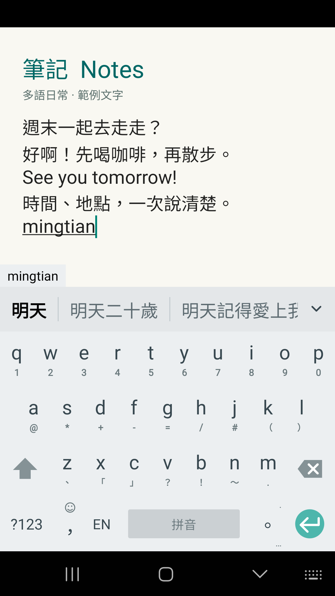
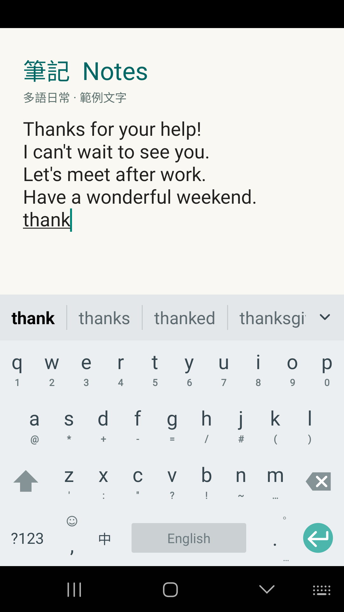
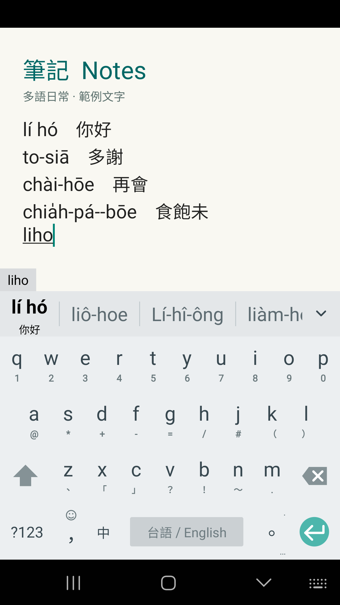
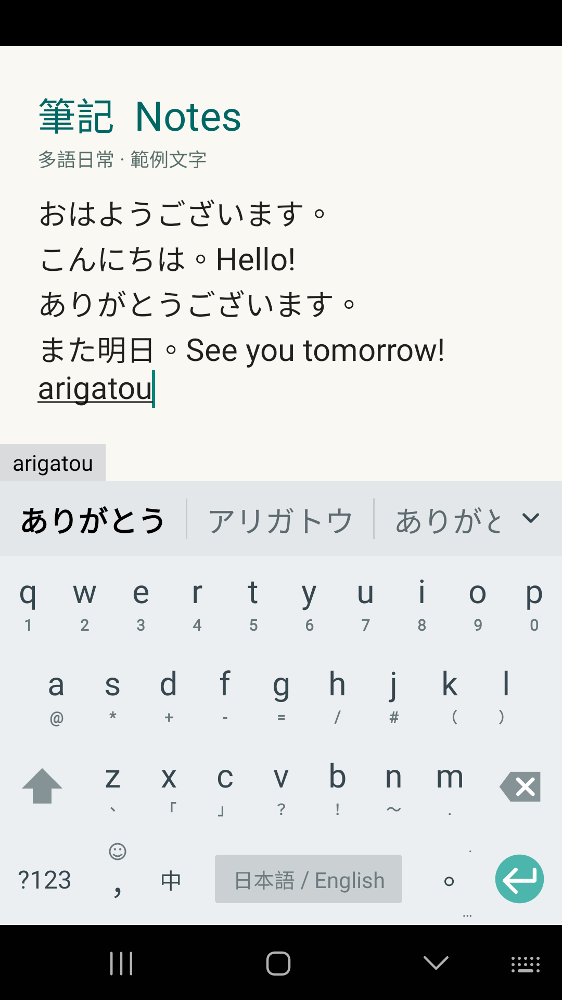
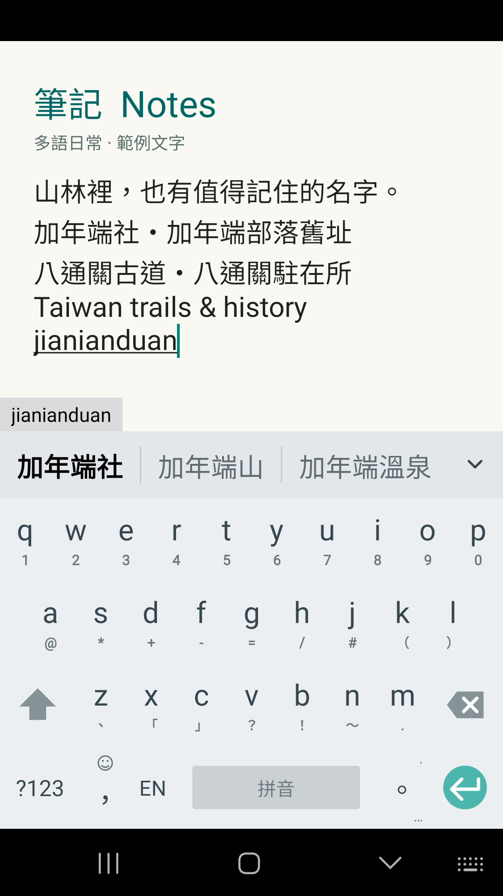
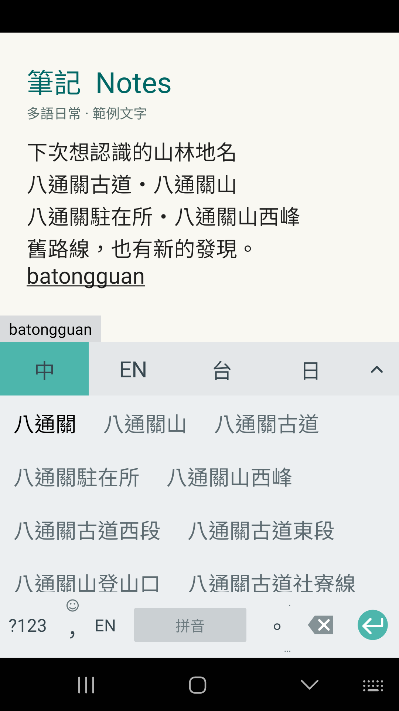
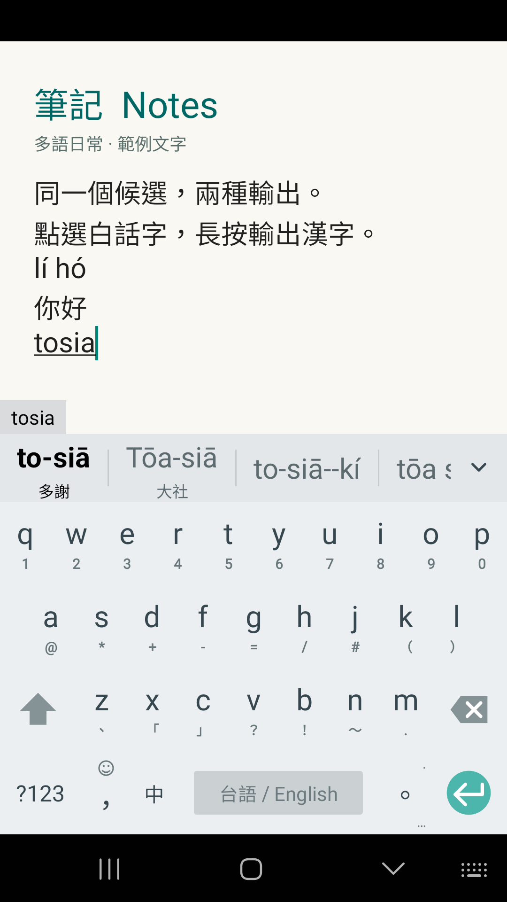
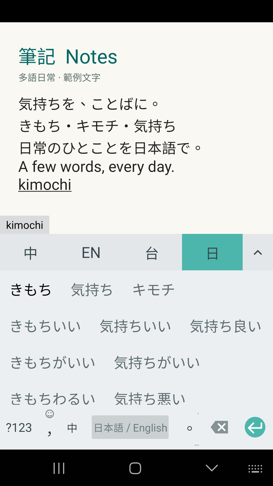

# MinIME — richer screenshot set

Eight unmodified 1080x1920 RGB phone screenshots, captured September 13, 2026
from the verified 0.8.5-review1 debug APK. Open index.html for the gallery.

The Notes area contains authored, prefilled example context. Only the recorded
typedInput was entered during each candidate demonstration. The keyboard and
candidate text are real app output; scene 07 also asserts real tap/hold outputs
and records those completed interactions. No candidate pixels were fabricated,
retouched or rearranged. The context is not a coverage benchmark or a claim
that MinIME contains a Notes application. store-candidates.json separates
prefilled text, input, mode, expansion state and observed labels.

The original jianianduan / 加年端社 check is retained. The capture harness requires
the requested place and checks every visible geography choice against matching
Rudy entries. Dictionary and ranking data were not changed for these examples.

These screenshots belong to 0.8.5-review1. The existing 0.8.4 store kit and signed
release binaries remain separate; this screenshot refresh does not approve a
Google Play release. Phone cleanup and capture evidence are in CAPTURE.md.

Order: bilingual conversation, English writing, Taiwanese with Han hints,
Japanese everyday phrases, 加年端社, 八通關 places, Taiwanese tap/hold output,
expanded Japanese choices. Each original PNG can be used independently.

## Preview

[Download all eight PNGs and the offline gallery](MinIME-Screenshots-20260913.zip)

